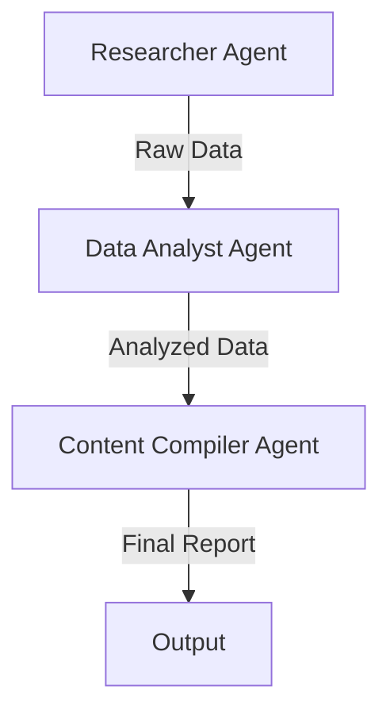

# Agent Specifications

The Company Research Agent uses three specialized AI agents, each with a specific role in the research process. This document details each agent's configuration and responsibilities.

## Researcher Agent

The primary data gathering agent.

```python
@agent
def researcher(self) -> Agent:
    """
    @agent Company Research Specialist
    @description Expert in gathering comprehensive company information
    @returns Agent - Configured researcher agent
    """
    return Agent(
        role="Company Research Specialist",
        goal="Gather comprehensive information about companies from various sources",
        backstory="""You are an expert business researcher with years of experience
        in gathering and analyzing company information. You excel at finding accurate
        and relevant details about organizations, their products, and market presence.""",
        tools=[
            CompanyNewsSearchTool(actor=self.actor),
            ProfessionalProfilesTool(actor=self.actor),
            LinkedInScraperTool(actor=self.actor),
            CrunchbaseScraperTool(actor=self.actor),
            PitchBookScraperTool(actor=self.actor),
            GoogleSearchTool(actor=self.actor)
        ],
        llm=self.llm
    )
```

### Researcher Capabilities

<CardGroup cols={2}>
  <Card title="News Search" icon="newspaper">
    Finds and analyzes recent news articles about the company
  </Card>
  <Card title="Profile Discovery" icon="building">
    Locates company profiles across professional platforms
  </Card>
  <Card title="Data Scraping" icon="spider">
    Extracts detailed information from various sources
  </Card>
  <Card title="Search Integration" icon="magnifying-glass">
    Performs targeted Google searches for specific information
  </Card>
</CardGroup>

## Data Analyst Agent

Processes and analyzes gathered information.

```python
@agent
def data_analyst(self) -> Agent:
    """
    @agent Business Data Analyst
    @description Expert in analyzing company data and extracting insights
    @returns Agent - Configured analyst agent
    """
    return Agent(
        role="Business Data Analyst",
        goal="Analyze company data and extract meaningful insights",
        backstory="""You are a skilled data analyst specializing in business metrics
        and market analysis. You have a strong background in interpreting company 
        performance data and identifying market trends.""",
        llm=self.llm
    )
```

### Analysis Capabilities

- Market trend identification
- Financial metric analysis
- Competitive landscape assessment
- Growth pattern recognition
- Risk factor identification

## Content Compiler Agent

Formats and structures the research findings.

```python
@agent
def content_compiler(self) -> Agent:
    """
    @agent Business Report Writer
    @description Expert in creating comprehensive business reports
    @returns Agent - Configured compiler agent
    """
    return Agent(
        role="Business Report Writer",
        goal="Compile research findings into comprehensive, well-structured reports",
        backstory="""You are an experienced business writer who excels at organizing
        complex information into clear, actionable reports. You have a keen eye for
        important details and can present information in a professional format.""",
        llm=self.llm
    )
```

### Compilation Capabilities

- Report structuring
- Key insight highlighting
- Data visualization recommendations
- Executive summary creation
- Action item identification

## Agent Interaction Flow



## Configuration Parameters

### Common Parameters

| Parameter | Type | Description |
|-----------|------|-------------|
| role | string | Agent's specific role |
| goal | string | Primary objective |
| backstory | string | Context and expertise |
| llm | LLM | Language model instance |

### Researcher-Specific Parameters

| Parameter | Type | Description |
|-----------|------|-------------|
| tools | List[BaseTool] | Available research tools |
| verbose | boolean | Output verbosity |

## Best Practices

1. **Agent Independence**
   - Each agent operates independently
   - Clear separation of responsibilities
   - Minimal cross-agent dependencies

2. **Error Handling**
   - Agents handle task-specific errors
   - Graceful failure recovery
   - Clear error reporting

3. **Performance Optimization**
   - Efficient tool usage
   - Resource management
   - Output filtering

<Note>
Agents are designed to be autonomous but collaborative. Each agent focuses on its specific role while contributing to the overall research objective.
</Note>
