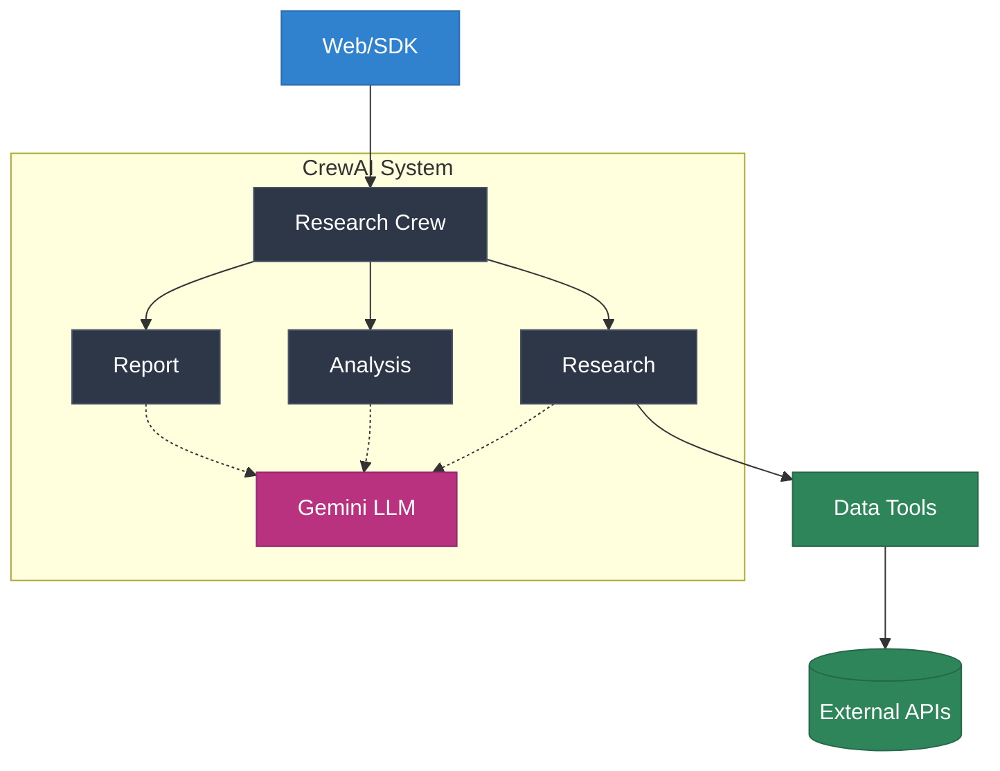

# Company Research & Analysis Agent

The Company Research & Analysis Agent is a powerful AI-driven tool that performs comprehensive company research by coordinating multiple specialized AI agents using CrewAI. It aggregates data from authoritative sources like LinkedIn, PitchBook, and Crunchbase to provide detailed insights for business intelligence, market research, competitive analysis, and investment decision making.

## System Architecture

## Key Features

<CardGroup cols={2}>
  <Card title="AI Agent Collaboration" icon="robot">
    Multiple specialized AI agents work together to research, analyze, and report company information
  </Card>
  <Card title="Comprehensive Profiles" icon="building">
    Detailed information about company operations, products, and services from multiple sources
  </Card>
  <Card title="Financial Analysis" icon="chart-line">
    Real-time financial data including funding history and investment trends
  </Card>
  <Card title="Market Intelligence" icon="globe">
    Competitive analysis, market positioning, and industry insights
  </Card>
</CardGroup>

## How It Works

1. User accesses the system via web interface or Python SDK
2. The CrewAI system coordinates three specialized agents:
   - Research agent collects company data
   - Analysis agent processes findings
   - Report agent creates final output
3. Data tools connect to external services (LinkedIn, Crunchbase, etc.)
4. Gemini LLM powers all agent decisions and analysis

## Use Cases

The agent supports various business needs:

- **Due Diligence**: Research for mergers, acquisitions, and investments
- **Competitive Analysis**: Gather market intelligence and competitor insights
- **Lead Generation**: Identify and qualify business development prospects
- **Investment Research**: Support financial analysis and decision making
- **Industry Analysis**: Track market trends and industry developments
- **Recruitment**: Research potential employers or acquisition targets

## Data Sources

We aggregate data from multiple authoritative sources:

- **LinkedIn**: Company profiles, employee count, job openings
- **PitchBook**: Investment data, funding rounds, acquisitions
- **Crunchbase**: Company information, financials, investors
- **Google News**: Recent developments and news coverage

## AI-Powered Analysis

The system leverages multiple AI components:

1. **CrewAI Framework**: Coordinates AI agents for different tasks
2. **Google's Gemini Model**: Powers analysis and report generation
3. **Custom Tools**: AI-driven data collection and processing
4. **Automated Insights**: Pattern recognition and trend analysis

<Note>
The agent uses AI to not just collect data but also analyze and present it in a meaningful way, making it a powerful tool for business research and decision-making.
</Note>

## Getting Started

Ready to start researching companies? Head over to our [Getting Started](/getting-started) guide to begin using the Company Research & Analysis Agent.
